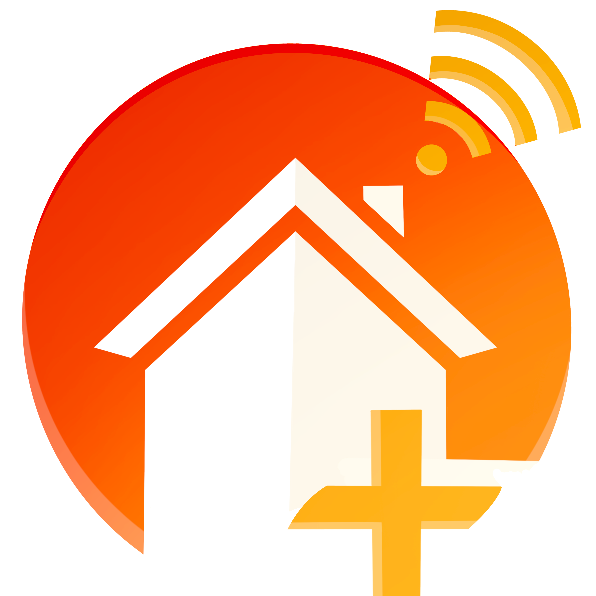
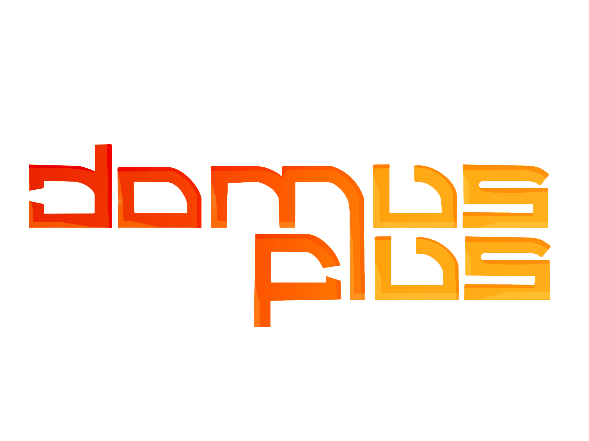
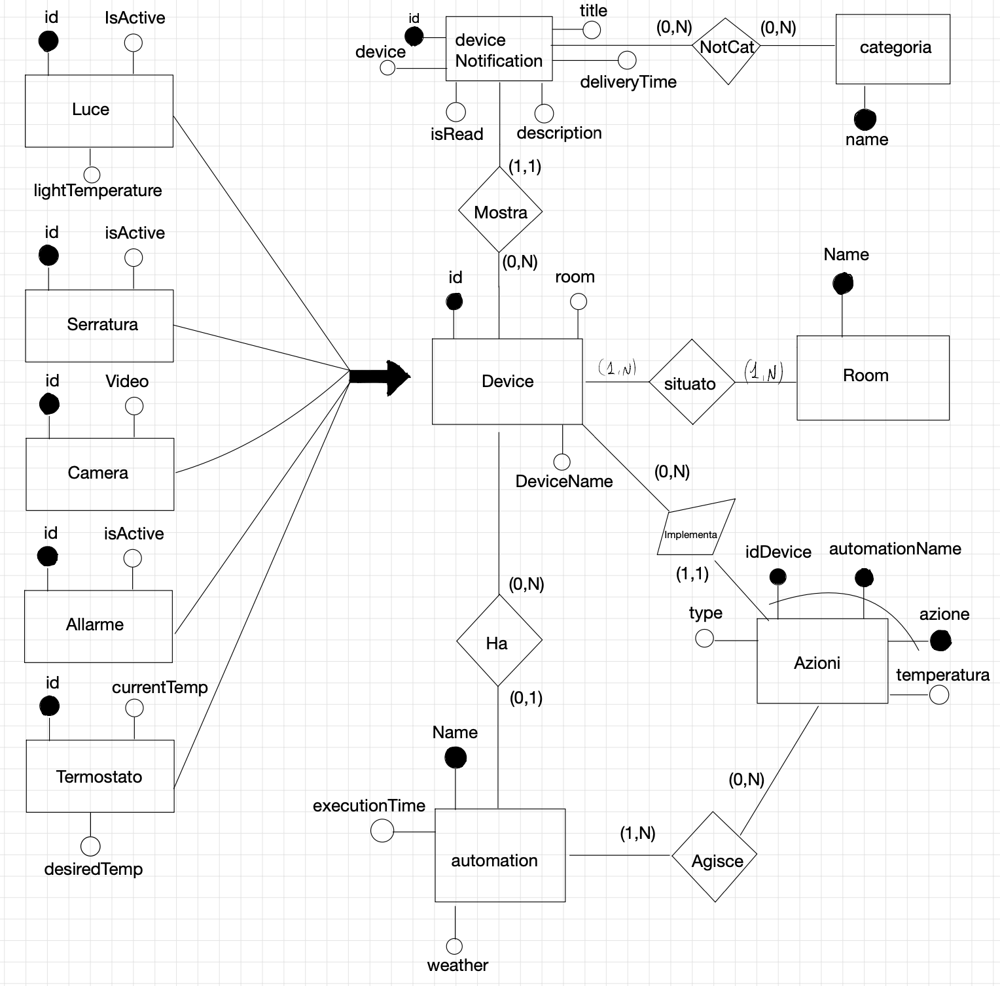
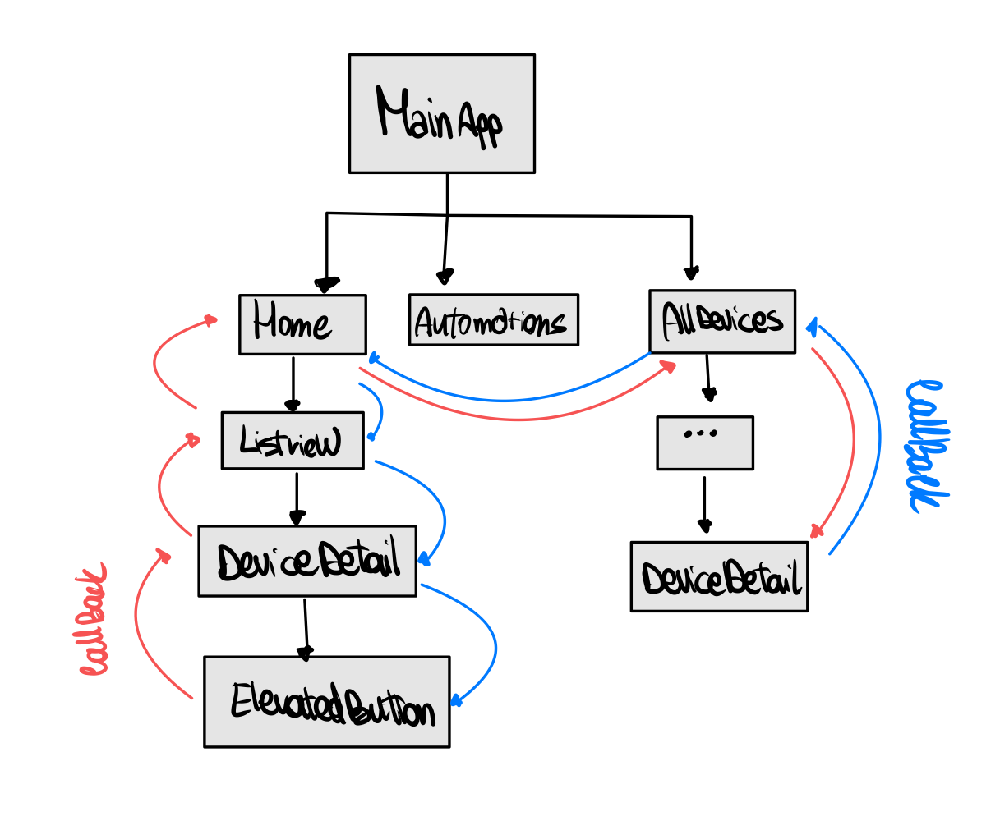
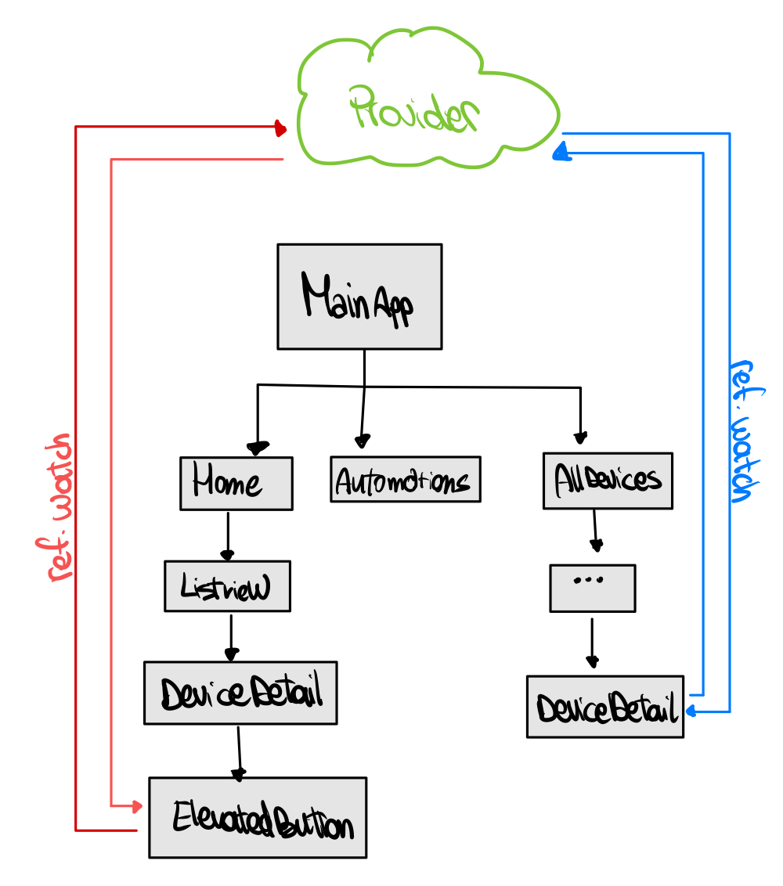

<h1 class="unnumbered" id="prefazione">Prefazione</h1>
<h4 id="scelta-del-nome">Scelta del nome</h4>

Il nome <em>domusplus</em> è stato scelto con cura per richiamare una
connessione tra tradizione e innovazione, tra passato e futuro. Difatti,
<em>domusplus</em> è composto:

<ul>
<li>
dal nome latino <em>domus</em>, che indica un tipo di abitazione
utilizzato nell’antica Roma e, più in generale, la
<strong>casa</strong>;
</li>
<li>
dall’avverbio latino <em>plus</em>, che indica un’eccedenza, un
qualcosa in più, un <strong>potenziamento</strong>.
</li>
</ul>

Da qui, il concept alla base dell’app: non una semplice casa, ma una
casa smart. Il gioco di parole che si nasconde dietro <em>us</em>,
presente sia in domus che in plus, non è casuale ma si ispira alla
pronuncia inglese del latinismo plus, che richiama il pronome
complemento “us”, ovvero <em>noi</em>. Ciò è stato pensato per suggerire
un’idea di comunità, di appartenenza, di condivisione, di “home” e non
solo di “house”.

<h4 id="il-design">Il design</h4>

Per il design di <em>domusplus</em>, è stato scelto uno stile
minimalista e al tempo stesso efficace poiché intuitivo. Nel logo, le
linee dritte incontrato linee curve delicate, affinché venga generata
un’armonia visiva che catturi l’attenzione e permetta una leggibilità
intuitiva. Sono stati scelti i colori caldi per evocare il calore
accogliente, tipico della familiarità della domus, della casa.

<figure id="fig:app-logo">

<figcaption>Logo dell’app.</figcaption>
</figure>
<figure id="fig:typography">

<figcaption>Tipografia derivata dal logo dell’app.</figcaption>
</figure>
<h1 id="finalità-del-progetto">Finalità del progetto</h1>

La finalità del presente progetto è quella di sviluppare
un’applicazione <em>cross-platform</em> mediante l’utilizzo di uno tra i
due framework più noti per lo scopo: Flutter e React Native.

Lo scopo dell’applicazione realizzata è quello di consentire la
gestione di dispositivi smart di un’abitazione, quali lampadine,
termostati, serrature, allarmi e videocamere, in modo manuale o mediante
automazioni, cioè “routines” che prevedono lo svolgimento di operazioni
in automatico al raggiungimento di una certa ora e/o una certa
condizione metereologica<a href="#fn1" class="footnote-ref" id="fnref1"
role="doc-noteref">1</a>.

Di ogni dispositivo è possibile controllare i dati sul consumo
energetico mediante la realizzazione di un grafico che mostra il consumo
in kilowattora nelle ultime 24 ore.

L’applicazione è anche in grado di generare localmente delle
notifiche per informare l’utente sul cambiamento dello stato di
dispositivi critici (ad esempio, quando un allarme viene
disinserito).

<h1 id="scelta-del-framework">Scelta del framework</h1>

Il framework scelto per la realizzazione del progetto è
<strong>Flutter</strong>.

Dopo un’attenta analisi dei requisiti richiesti per la realizzazione
dell’applicazione e dei mockup, la selezione è ricaduta sul prodotto
open source di Google, per i seguenti motivi principali:

<ul>
<li>
<strong>Flutter è indicato come il candidato designato per
sviluppare progetti mission-critical in tempo ridotto</strong>, ove
React Native presenta una curva di apprendimento più ripida. In
particolare, l’impianto del framework basato su un linguaggio di
programmazione orientato agli oggetti, quale è Dart, è stato di aiuto
nello sviluppo, consentendo di sfruttare a pieno le conoscenze pregresse
acquisite nell’ambito di esperienze con altri linguaggi di
programmazione (e.g. Java) e presentando, tra l’altro, alcune migliorie
che consentono di scrivere un codice (sebbene più verboso) estremamente
facile da leggere e da gestire, come:

<ul>
<li>
<em>named parameters</em>;
</li>
<li>
<em>named constructors</em>;
</li>
<li>
<code>null</code> <em>safety</em>.
</li>
</ul>

Inoltre, l’estensione per i vari IDE consente una gestione immediata
dei widget, come: racchiudere - <em>wrap</em> - un widget all’interno di
un widget “contenitore”, rimuovere widget, performare <em>hot
reload</em>/<em>hot restart</em> e la funzione di <em>beautify</em> del
codice, per mantenere coerente l’indentazione;
</li>
<li>
<strong>Flutter utilizza i propri widget</strong>, mentre React
Native utilizza i widget nativi dell’host su cui l’applicazione esegue.
Questo aspetto ha permesso di costruire, con una singola codebase, un
applicativo la cui User Interface rimane uguale a prescindere dall’OS
sfruttato dall’host su cui l’applicazione è eseguita, evitando
potenziali difformità nell’aspetto;
</li>
<li>
<strong>Flutter è supportato da una documentazione ufficiale
facile da consultare</strong>, cui si affiancano numerose altre risorse,
come tutorial dal team di sviluppo del framework o video “in pillole”
(e.g. <em>Widget of the week</em>, una rubrica settimanale in grado di
spiegare in un paio di minuti quasi ogni widget presente nel catalogo di
widget predefiniti di Flutter). Inoltre, la documentazione dei widget è
comodamente integrata anche all’interno dell’IDE, rendendo estremamente
veloce completare e personalizzare nel migliore dei modi ciascun
widget.
</li>
</ul>
<h1 id="implementazione">Implementazione</h1>
<h2 id="struttura-del-codice">Struttura del codice</h2>

I componenti dell’applicativo si strutturano su quattro
categorie:

<ol>
<li>
<code>models</code>: sono la rappresentazione in linguaggio Dart
degli oggetti della realtà di interesse che si vuole manipolare (i
dispositivi, le notifiche, le automazioni);
</li>
<li>
<code>services</code>: rappresentano delle classi che consentono
di svolgere dei tasks in background rispetto all’interfaccia grafica,
come le operazioni di sincronizzazione con il database;
</li>
<li>
<code>views</code>: sono le rappresentazioni delle schermate
dell’applicazione mediante la combinazione di widget elementari che
Flutter mette a disposizione, principalmente tratti dalla libreria
<code>Material</code> per realizzare un’applicazione la cui UI sia
compliant con i canoni del <em>Material Design 3</em>;
</li>
<li>
<code>provider</code>: rappresentano i componenti per la gestione
dello stato, mediante il framework <em>Riverpod</em>.
</li>
</ol>

Si dispone di un ulteriore file, <code>main.dart</code>, entry point
dell’applicazione che imposta lo scheletro per la navigazione di base
dell’app, richiamando i widget delle schermate accessibili dalla navbar
e definisce il tema.

<h2 id="persistenza-dei-dati">Persistenza dei dati</h2>

La persistenza dei dati viene realizzata per mezzo del pacchetto
<code>sqflite</code> di Flutter, con cui si implementa un database
relazionale al quale si accede mediante l’engine <code>SQLite</code>
fornito dal pacchetto.

Per l’ideazione del database, si sfrutta il classico flusso di
progetto, a partire dalla progettazione concettuale, con cui è stata
descritta la realtà di interesse in modo formale, evidenziando le entità
coinvolte e come queste interagiscono tra di loro. Segue poi la fase di
progettazione logica e la realizzazione fisica con la creazione delle
tabelle.

<figure id="fig:schema-concettuale">

<figcaption>Schema concettuale del database utilizzato
dall’applicazione.</figcaption>
</figure>
<h2 id="problemi-affrontati-nello-sviluppo">Problemi affrontati nello
sviluppo</h2>
<h3 id="gestione-dello-stato">Gestione dello stato</h3>

Flutter mette a disposizione due superclassi di widget:
<code>StatelessWidget</code> e <code>StatefulWidget</code>.

Come suggerisce il nome, i widget che estendono
<code>StatelessWidget</code> sono dei widget che non consentono di
memorizzare alcuno stato durante l’esecuzione dell’applicazione: il loro
compito è, semplicemente, quello di mostrare sulla UI il widget stesso,
consentendo l’esecuzione di azioni al rilevamento di alcune gestures
mediante il richiamo di funzioni e procedure. La particolarità degli
<code>StatelessWidget</code> è che sono <strong>immutabili</strong><a
href="#fn2" class="footnote-ref" id="fnref2"
role="doc-noteref">2</a>: una volta disegnati sullo schermo,
questi non potranno mutare il loro aspetto.

I widget che estendono <code>StatefulWidget</code>, d’altro canto,
consentono il salvataggio di uno stato; questa caratteristica è cruciale
quando si desidera implementare componenti come selezioni, mediante il
widget <code>Radio</code>, ma anche mediante <code>Chip</code> o, più
banalmente, il cui aspetto deve cambiare nel corso di vita dell’app. Si
può interpretare lo “stato” come una variabile, una struttura dati o un
qualsiasi altro oggetto che, quando è soggetto di modifica, causa il il
<em>re-build</em> di un widget, di cui muterà l’aspetto.

Ad ogni modo, per la gestione dello stato, Flutter mette a
disposizione, mediante plugins, soluzioni che consentono una gestione
più granulare dello stato, come i packages <code>Provider</code> e
<code>Riverpod</code>: si è fatto uso proprio di
<strong><code>Riverpod</code></strong> per una gestione dello stato
ancora più efficiente, sia da un punto di vista implementativo, che dal
punto di vista prestazionale.

Con l’implementazione dei provider <em>à la</em> Riverpod, è
possibile “wrappare” l’intera app in un <code>ProviderScope</code>;
questa azione consente, ad ogni widget dell’applicazione, di accedere ai
<em>provider</em>, cioè dei componenti che hanno lo scopo di separare lo
stato di un widget dal widget stesso, pur mantenendo la possibilità di
fare re-build al cambiamento dello stato.

La separazione dello stato dal widget è un’operazione che, come
anticipato, comporta grossi vantaggi, sia in termini prestazionali, sia
in termini di efficienza in fase di implementazione. Il motivo è da
ricercarsi nel fatto che, con i provider, lo stato diventa “globale” e
non più strettamente contenuto in un singolo widget; condividere lo
stato tra più widget (anche tra più schermate, o tra componenti diversi
di schermate diverse), non richiede più che lo stato sia passato dal
widget in cui avviene la modifica, fino a - potenzialmente - la root
dell’applicazione e, di nuovo, dalla root ad una nuova schermata o al
componente di una nuova schermata. Oltre ad essere computazionalmente
più esoso, diventa terribilmente più complesso da realizzare, dovendo
gestire una “catena” di callbacks tra i widget, di cui può diventare
estremamente arduo tenere traccia già anche in progetti di piccole
dimensioni.

Per fini didattici, si è provveduto ad implementare una soluzione
simile a quella gestita, comprendendo che l’approccio senza provider è
sfruttabile unicamente (risultando persino più conveniente di un
provider) per scambiare piccoli pezzi di informazione, tra un componente
specifico della pagina e la pagina stessa che lo include (essendo, anche
questa, un widget). Lo si realizza mediante l’aggiunta, nel
widget-componente, di un parametro di tipo
<code>ValueChanged&lt;T&gt;</code>, che specifica una funzione da
eseguire all’interno del widget-pagina, accettando un parametro del tipo
generico <code>&lt;T&gt;</code>; quando si aggiorna lo stato nel
componente, questo eseguirà sia la funzione specificata nel parametro,
non senza aver prima invocato la funzione <code>setState()</code>, che
aggiornerà lo stato del componente e ne causerà il re-build. La funzione
specificata nel parametro di tipo <code>ValueChanged&lt;T&gt;</code>
invocherà, a sua volta, la funzione <code>setState()</code> nel
widget-pagina, causando il re-build anche della pagina che include il
componente. Il vantaggio prestazionale dell’usare un provider è
l’assenza della necessità di gestire la “catena” di callbacks per
aggiornare lo stato di ogni componente, comportando in più
l’eliminazione di re-build inutili (la catena di callbacks provocherebbe
l’invocazione della <code>setState()</code> e conseguente re-build anche
di schermate intermedie che non dipendono esplicitamente
dall’informazione modificata).

La differenza tra l’uso di semplici <code>StatefulWidget</code> e
l’uso dei <code>Provider</code> viene illustrata nelle figure <a
href="#fig:widget-tree-noprov" data-reference-type="ref"
data-reference="fig:widget-tree-noprov">4</a> e <a
href="#fig:widget-tree-prov" data-reference-type="ref"
data-reference="fig:widget-tree-prov">5</a>.

<figure id="fig:widget-tree-noprov">

<figcaption>Widget Tree e chain di callbacks senza l’uso dei
Provider.</figcaption>
</figure>
<figure id="fig:widget-tree-prov">

<figcaption>Widget tree e uso dei provider.</figcaption>
</figure>
<h3 id="gestione-della-navigazione">Gestione della navigazione</h3>

Come per la gestione dello stato, in Flutter sono presenti delle
librerie per la gestione della navigazione, cioè il “percorso” che un
utente compie tra le varie schermate dell’applicazione.

<strong>Diversamente da React Native</strong><a href="#fn3"
class="footnote-ref" id="fnref3" role="doc-noteref">3</a>,
Flutter include, come anticipato, delle librerie per la gestione della
navigazione, mentre restano disponibili packages esterni che, come per
lo state management, consentono un controllo più granulare e avanzato
della navigazione (si pensi all’uso di link).

La soluzione implementata nel progetto coinvolge l’utilizzo di due
componenti principali:

<ul>
<li>
<code>Navigator</code>;
</li>
<li>
<code>MaterialPageRoute</code>.
</li>
</ul>

L’utilizzo di <code>Navigator</code> si rivela sufficiente per la
gestione della navigazione all’interno dell’applicazione. Questo
componente funziona a mo’ di stack, in cui, delle varie schermate, viene
eseguita l’azione di <em>push</em> per mostrarle e l’azione di
<em>pop</em> per rimuoverle e, dunque, tornare indietro alla schermata
precedente.

La classe <code>MaterialPageRoute</code> entra in gioco poiché è un
tipo di widget, da passare come parametro alla funzione
<code>Navigator.push()</code>, che descrive la schermata da
mostrare.

<h3 id="database-e-oggetti">Database e oggetti</h3>

Utilizzando <code>SQFlite</code> per implementare la persistenza dei
dati, si è sfruttato l’<em>Object-Relational Mapping</em> (ORM), una
funzionalità che consente di operare sul database, senza dover
necessariamente scrivere istruzioni in linguaggio SQL.

Sebbene molto comoda, si è riusciti nel fare il grosso delle
operazioni sfruttando proprio l’ORM, limitando all’osso il numero di
numero di operazioni svolte mediante l’utilizzo del linguaggio SQL (le
cosiddette <em>raw query</em>), per ottenere un risultato granularmente
personalizzato.

<h3 id="invio-delle-notifiche">Invio delle notifiche</h3>

Le push notifications vengono inviate ogni volta che un dispositivo
(serratura, allarme, luce) cambia stato.

Si implementa questa funzione attraverso il plugin
<code>flutter_local_notification</code>.

Nella pagina di dettaglio di un dispositivo, alla selezione del
pulsante, si crea una notifica (<code>DeviceNotification</code>) da
passare al metodo <code>showNotification</code> (verificare nome),
che:

<ul>
<li>
mostra la notifica a schermo;
</li>
<li>
inoltra la notifica al provider per aggiornare lo stato della
pagina delle notifiche.
</li>
</ul>

Si è preferito utilizzare questo plugin anziché
<code>firebase.messaging</code> poiché non si ha la necessità di inviare
delle notifiche in broadcast a tutti gli utenti registrati, ma solo a
quegli utenti che eseguono una determinata azione, nel momento in cui
tale azione è generata; in questo senso, generare la notifica localmente
riduce anche l’overhead che può derivare dalla connessione ad una
console remota.

Inoltre il meccanismo basato su token, generato dal client e da
passare al server, alla base di <code>firebase.messaging</code>,
comporta un’aggiunta di complessità che, per i constraint temporali, si
preferisce risparmiare per dedicare maggiore attenzione ad altri
componenti dell’applicativo.

<section id="footnotes" class="footnotes footnotes-end-of-document"
role="doc-endnotes">

<ol>
<li id="fn1">
Si fornisce un concept realizzando l’impostazione della
gestione grafica dell’automazione ma, a causa dei vincoli temporali, non
è stato possibile implementare una funzione in grado di eseguire
costantemente in background un controllo periodico della posizione
dell’utente e dell’orario, cui far seguire l’aggiornamento dei
dispositivi.<a href="#fnref1" class="footnote-back"
role="doc-backlink">↩︎</a>
</li>
<li id="fn2">
Ci si riferisce ad una immutabilità nel senso grafico,
cioè di presentazione, piuttosto che dal punto di vista di come il
componente viene salvato nella memoria del dispositivo: infatti, anche i
componenti utilizzati per costruire <code>StatefulWidget</code>
sfruttano l’immutabilità dal punto di vista della memoria, ma non dal
punto di vista della presentazione.<a href="#fnref2"
class="footnote-back" role="doc-backlink">↩︎</a>
</li>
<li id="fn3">
In React Native, la gestione della navigazione è
possibile unicamente mediante l’utilizzo di packages esterni.<a
href="#fnref3" class="footnote-back" role="doc-backlink">↩︎</a>
</li>
</ol>
</section>